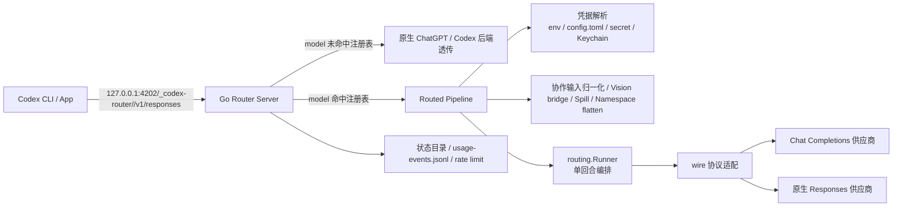

# Model Router 架构调研

> 调研日期：2026-08-16
> 基线：分支 `go-rewrite`，提交 `9c3daa7`（`🔧 chore: 清理冗余文件与旧代码`）
> 性质：只读源码与构建脚本调研；本文不包含服务启动、请求实测或安装环境验证。

## 1. 项目定位

Model Router 是一个本地 Codex 模型路由器：它把 Codex 发出的 OpenAI Responses 请求接住，再根据请求中的 `model` 决定流量去向。

- **未命中注册表**：按原生 ChatGPT / Codex 后端流量透传。
- **命中注册表**：解析供应商凭据，改写请求，按供应商协议转发到外部模型服务，并把上游响应转换回 Codex 可消费的 Responses 事件流。

当前仓库是原 Node.js + LiteLLM 架构的 Go 单二进制重写版。macOS 的 `Model Router.app` 是这个 Go 服务的外壳；发行形态里 App bundle 内嵌同一个 `codex-router` Go 二进制。

## 2. 总体架构



核心设计是：**Codex 始终只看到一个本地 Responses API**。模型名、上游鉴权、协议差异、流式响应转换和模型目录发布，都由本地路由器统一处理。

## 3. 文件架构

| 路径 | 职责 |
| --- | --- |
| `cmd/codex-router/` | CLI 入口：`serve`、`install`、`uninstall`、`discover`、`doctor`、`control`、`shim` 等子命令。 |
| `internal/server/` | HTTP transport：路由、认证、Responses 分流、WS 代理、错误翻译、usage 记录，以及把 HTTP 响应绑定到 routing 接缝。 |
| `internal/routing/` | 一次 routed turn 的完整编排：输入归一化、视觉桥、工具/namespace 适配、wire 调用、流式守卫、错误收尾与 usage 计量。 |
| `internal/nativebackend/` | 原生 ChatGPT/Codex 后端适配：白名单请求头、会话凭据兜底、响应转发和图片描述。 |
| `internal/registry/` | 内嵌供应商与模型注册表；加载 `config/` 目录并建立 `slug` / `gatewayModel` 索引。 |
| `internal/registry/config/` | 各供应商与模型的 JSON 注册表片段，通过 `go:embed` 打进二进制。 |
| `internal/wire/` | 协议抽象层：把“Codex 说 Responses”与“上游供应商协议”解耦。 |
| `internal/wire/chatcompletion/` | Responses ↔ Chat Completions 翻译路径。 |
| `internal/wire/responses/` | 上游原生支持 Responses 时的直通协议路径。 |
| `internal/translate/` | 请求、响应、工具、namespace、Codex App 工具的具体翻译逻辑。 |
| `internal/cred/` | 供应商凭据解析：环境变量 → `config.toml` → secret 文件 → macOS Keychain。 |
| `internal/state/` | 管理 `~/.codex-router`：caller/internal secret、配置、模型可见性与子代理设置。 |
| `internal/catalog/` | 合并 Codex 原生模型与注册表路由模型，生成 picker 用的 `merged-models.json`。 |
| `internal/usage/` | 记录 `usage-events.jsonl`，维护配额、限流、供应商用量统计。 |
| `internal/vision/` | 图片桥：文本模型无法直接读图时，由本地视觉模型先读图并转成文字描述。 |
| `internal/httpx/` | HTTP 客户端、压缩、超时、SSE / 流式传输基础设施。 |
| `apps/macos/ModelRouterTray/` | macOS Swift / SwiftUI App：托盘、主窗口、设置页、服务托管、模型管理。 |
| `skills/` | 项目相关 Codex 技能说明。 |
| `docs/` | 研究与架构文档。 |
| `scripts/` | macOS App / 桌面托盘 / 图标等构建脚本。 |
| `Makefile` | 构建、测试、安装 App 与 CLI 的统一入口。 |

## 4. 运行形态

### 4.1 macOS App

`make app` 构建 `dist/Model Router.app`，并把 Go 服务编进 App 的 `Contents/MacOS/codex-router`。

App 启动后由 Swift `ServiceSupervisor` 管理服务生命周期：

1. 先请求本地 `/health`；
2. 已有健康实例时不重复启动；
3. 没有健康实例时启动内嵌的 `codex-router serve --state ...` 子进程；
4. App 退出时向子进程发 SIGTERM，3 秒内不退出再 SIGKILL；
5. 子进程异常退出时按 1s、2s、4s、8s、16s 指数退避重启，最多 5 次；
6. 如果端口已被外部健康实例接管，则不抢启。

### 4.2 CLI 服务

`make cli` 构建 `dist/codex-router`。直接运行：

```bash
./dist/codex-router serve
```

服务默认监听：

```text
127.0.0.1:4202
```

只绑定本机回环地址，不暴露到局域网。端口可用 `MODEL_ROUTER_PORT` 或 `CODEX_ROUTER_PORT` 覆盖。

## 5. Codex 接入与认证

执行 `codex-router install` 后，路由器会修改 Codex 配置（默认 `~/.codex/config.toml`，或 `$CODEX_HOME/config.toml`），写入两个受管理块：

1. 根级块：`openai_base_url` 与 `model_catalog_json`；
2. provider 块：`[model_providers.codex-router]`。

关键 URL 形态：

```text
http://127.0.0.1:4202/_codex-router/<caller-secret>/v1
```

caller secret 保存在：

```text
~/.codex-router/caller-secret
```

服务端用常数时间比较校验 URL 路径中的 secret；除 `/health` 外，其余请求都需要认证。卸载时只移除受管理块，保留用户自有配置。

## 6. 请求生命周期

以 Codex 发送 `POST /v1/responses` 为例。

### 6.1 HTTP 路由

服务支持的主要路由：

```text
GET  /health
GET  /models
POST /responses
POST /v1/responses
POST /responses/compact
POST /v1/responses/compact
POST /v1/images/...
POST /v1/search/...
```

`/responses` 是主链路；GET 且带 WebSocket Upgrade 的 Responses 请求会进入 WS 代理路径。

### 6.2 认证

路径必须带有 `/_codex-router/<caller-secret>/v1` 前缀。服务端取出 candidate key 并与本地 secret 做安全比较，失败返回 401。

### 6.3 模型分流

`handleResponses` 解析请求体中的 `model`，查询注册表索引：

- 命中 `slug` 或 `gatewayModel`：进入外部供应商路由；
- 未命中：按原生 OpenAI / ChatGPT 流量处理；
- 命中但 provider 被禁用：返回 `provider_not_enabled`。

### 6.4 原生透传路径

未命中注册表的模型按原生流量处理。路由器不翻译请求体，只做：

1. 白名单请求头过滤；
2. 必要时删除 ChatGPT 后端不支持的参数；
3. 若调用方没有有效上游凭据，注入本机 Codex 登录会话；
4. 转发到 `https://chatgpt.com/backend-api/codex`；
5. 原样回放响应。

本地 caller key / internal key 不会发给外部服务。

### 6.5 外部路由管线

命中注册表后，`server.handleResponses` 把认证后的请求元数据交给 `routing.Runner.Run`，按以下顺序处理：

1. **解析供应商凭据**：环境变量 → `config.toml` → secret 文件 → macOS Keychain。
2. **协作输入归一化**：把协作运行时的加密内容转换为外部模型可读形态。
3. **图片桥**：文本模型无法直接读图且本地视觉模型可用时，先由视觉模型描述图片，再替换为文字描述。
4. **合并 Codex App 工具**：补全客户端精简版 `codex_app` 工具集。
5. **Namespace 拍平**：把 namespace 工具展开为 `<ns>__<tool>`，响应方向再还原。
6. **选择协议适配器**：根据 provider 的 `Protocol` 字段选择 `wire.Protocol`。
7. **发起上游请求**：通过 `internal/httpx` 单次发送，带响应头超时、SSE 空闲看门狗。
8. **响应回放**：Chat Completions 响应重组为 Responses 事件流；原生 Responses 响应直通。
9. **记录 usage**：写入 `usage-events.jsonl`，用于供应商用量、失败率、限流统计。usage 的 `status` 表示回合结果；空补全虽然以 SSE `response.failed` 收尾，但按失败回合记录为 502。

压缩请求复用同一个 `Runner.RunCompaction` 上游编排；v1/v2 的最终响应外形仍由 `internal/server/compaction.go` 负责，因为它们分别需要 JSON 输出和合成 SSE 输出。

## 7. 协议抽象

`internal/wire` 是协议扩展点。每个协议实现 `wire.Protocol` 并在 `init()` 中注册；`routing.Runner` 只面向接口，不感知具体供应商协议。

当前有两条协议路径：

| 协议注册名 | 适用供应商 | 请求方向 | 响应方向 |
| --- | --- | --- | --- |
| `chat-completions` | 仅支持 Chat Completions 的 OpenAI-compatible 供应商 | Responses → Chat Completions | Chat SSE → Responses SSE |
| `responses` | 原生支持 Responses 的供应商 | 保留协议字段，仅还原上游模型名并剥除 Codex 专属标记 | 字节 / JSON 直通 |

新增协议时实现并注册 `wire.Protocol`，再在 provider 注册表中声明对应协议即可，不需要修改 server 主管线。

## 8. 模型注册表

注册表由 provider 与 model 两类 JSON 片段组成：

- **Provider**：ID、显示名、baseUrl、协议、凭据来源、models.dev ID 等；
- **Model**：路由 slug、gateway model、upstream model、provider、上下文窗口、输入模态、推理档位、请求画像等。

配置源位于：

```text
internal/registry/config/<provider>/<model>.json
```

并通过 `go:embed` 打进二进制。发行形态不需要额外携带配置目录。

启动时再叠加用户覆盖层：

```text
~/.codex-router/user-models.json
```

注册表支持 SIGUSR1 热重载：覆盖层变化后重载成功则原子替换 Server 内的注册表指针；失败时保留旧注册表。

## 9. 模型目录与 Picker

`internal/catalog` 负责生成 Codex picker 使用的模型目录：

1. 调用 `codex debug models` 抓取原生模型；
2. 读取注册表中的路由模型；
3. 过滤反馈环，避免路由模型被 Codex 反向抓取后重复出现；
4. 应用 provider 启用状态、模型隐藏设置、子代理设置；
5. 生成 `~/.codex-router/merged-models.json`；
6. 通过 Codex 的 `model_catalog_json` 配置发布。

这样 Codex picker 可以同时看到原生 GPT 模型与路由模型。

## 10. 状态目录与凭据

默认状态目录：

```text
~/.codex-router
```

可用 `CODEX_ROUTER_STATE_DIR` 覆盖。

主要内容包括：

- `caller-secret`：Codex 调用本地路由器的 key；
- `internal.key`：内部管理面 key；
- `config.toml`：用户供应商凭据与路由器设置；
- `user-models.json`：动态模型覆盖层；
- `merged-models.json`：发布给 Codex 的模型目录；
- `usage-events.jsonl`：每轮用量事件；
- `router.pid`：服务 pidfile。

供应商凭据解析顺序：

```text
环境变量
  → ~/.codex-router/config.toml
  → 状态目录 .secret 文件
  → macOS Keychain
```

## 11. 安全模型

1. **仅监听 127.0.0.1**：服务不直接暴露到局域网。
2. **caller key 嵌入 URL 路径**：除 `/health` 外所有请求必须携带。
3. **上游凭据留在本机**：供应商 API key 由本地解析，不写入 Codex 配置。
4. **请求头白名单透传**：未知 header 不转发给原生后端。
5. **本地路由 key 不外发**：发现 Authorization 是本地 caller/internal key 时，会替换或移除。
6. **受管理配置块**：install / uninstall 只改带标记的块，保留用户自有配置。
7. **状态文件权限受控**：secret、catalog、状态文件按 0600 / 0700 处理。

## 12. 构建与验证命令

优先使用 `Makefile`：

```bash
make help       # 查看可用目标
make version    # 打印版本
make cli        # 编译 CLI → dist/codex-router
make app        # 构建 App → dist/Model Router.app
make test       # go test ./...
make test-app   # Swift App 测试
make doctor     # 构建后运行 doctor 语义
make clean      # 清空 dist/
```

部署类目标：

```bash
make install-cli
make install-app
```

构建产物统一放 `dist/`。安装 CLI / App 时使用原子替换；安装 App 前如果 `ModelRouterTray` 正在运行，`install-app` 会拒绝继续。

## 13. 观察与运维

- 服务日志：App 托管形态写入 `~/.codex-router/router.log`。
- 服务管理：`codex-router control service start|stop|restart|status`。
- 注册表热重载：`codex-router control reload` / SIGUSR1。
- 用量统计：`usage-events.jsonl` 与 App 的供应商统计面板。
- 健康检查：`GET /health`（免认证）。

## 14. 已知残留与注意点

1. Swift 代码中仍有少量注释写着 launchd 托管，但实际生命周期已由 App 内 `ServiceSupervisor` 子进程托管；相关文字属历史残留。
2. `RouterProcessLocator` 有一个开发布局回退会查找 `bin/control`，但当前仓库没有该文件；发行形态优先使用 App 内嵌二进制，不受影响。
3. `launchd.go` 当前仅用于清理旧版 LaunchAgent 遗留，不再负责服务生命周期。
4. 本文档基于静态源码与构建脚本核对，未验证本机已安装 App、实际 `config.toml`、端口占用或线上请求行为。

## 15. 源码索引

| 主题 | 位置 |
| --- | --- |
| CLI 分发与 `serve` 入口 | `cmd/codex-router/main.go` |
| App 托管服务生命周期 | `apps/macos/ModelRouterTray/Sources/ModelRouterTrayApp.swift` |
| HTTP 路由与认证 | `internal/server/server.go` |
| Responses 分流 | `internal/server/routed.go` |
| 原生透传与请求头白名单 | `internal/server/native.go` |
| WebSocket 代理 | `internal/server/wsproxy.go` |
| 协议抽象 | `internal/wire/wire.go` |
| Chat Completions 翻译 | `internal/wire/chatcompletion/chatcompletion.go` |
| Responses 直通 | `internal/wire/responses/responses.go` |
| 注册表加载与内嵌 | `internal/registry/registry.go` |
| 用户覆盖层 | `internal/registry/overlay.go` |
| 凭据解析 | `internal/cred/cred.go` |
| 状态目录 | `internal/state/state.go` |
| 模型目录合并 | `internal/catalog/catalog.go` |
| 图片桥 | `internal/vision/vision.go` |
| HTTP 单次转发与看门狗 | `internal/httpx/httpx.go` |
| 用量事件 | `internal/usage/usage.go` |
| Codex 配置受管块 | `internal/configfile/configfile.go` |
